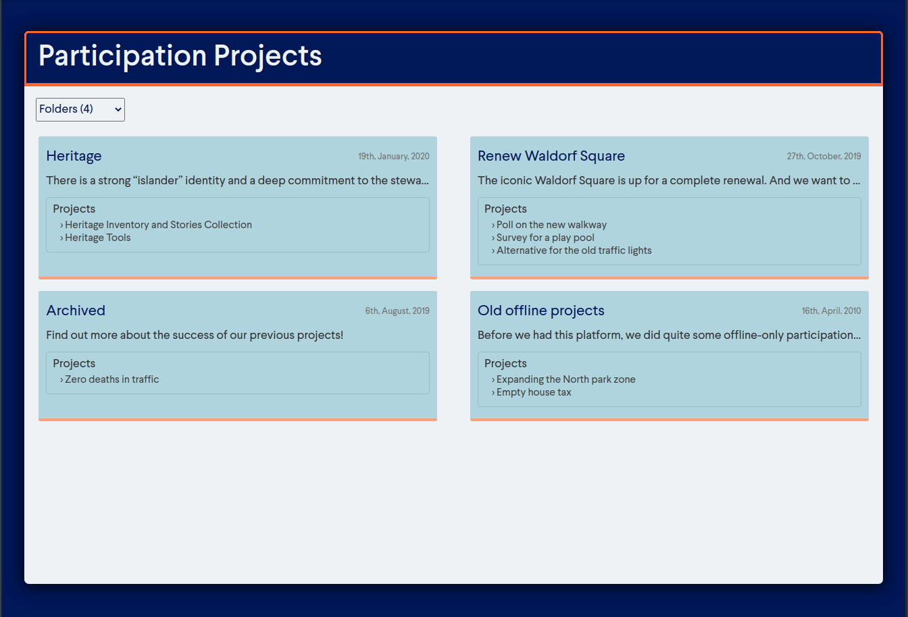

# CitizenLab Full-Stack Engineer Assignment

# Introduction

This repository houses the technical assignment assigned on behalf of CitizenLab. The objective of this assignment was to create a web application that allows citizens to browse through participation projects.

# Assignment & Outcomes

### Architecture & Technologies

For this project, I selected the use of Rails for the backend system and React for the frontend systems, both with the intention of more closely adhering to CitizenLabs own technologies. The database technology selected was PostgreSQL.

For project architecture, I have chosen to create the project within one single repository. Normally, I would choose to separate the frontend from the backend in separate repositories, however it makes logical sense to combine the React frontend with the Rails backend in one repository in this case.

### Checklist & Completion

The following are the completed tasks:

- [x] Data model that fully represents the described system
- [x] A documented way to load sample data into the database
- [x] Homepage listing projects and folders
- [ ] Topics filter on the homepage
- [ ] Bonus: Budget maximization
- [ ] Bonus: Folder info page
- [ ] Bonus: ... (Suprise us!)

All models have been set up, and the database functions correctly so that Project are able to be a part of Folders, Topics can be assigned to Projects, and each can be references easily from one another. Serializers have also been created to enhance the ease of passing this information over the front end.

The homepage currently displays all folders in a 2-per-row formation, with the title, date started, a shortened description and a list of projects as a part of the folder. Extending the current functionality of the frontend interface as it currently stands will rely on creating a separate 'projects component' (or extending the folder blocks to display the project information below upon clicking), and implementing the topic filtering.

## Setup & Use

#### Setup
  1. Ensure that you have [Node.js](https://nodejs.org/) installed on your machine. The project will not run without it.

  2. Download the respository, either via cloning or direct download.

  3. Once you have this project downloaded or cloned to your machine, `cd` to the root of the project in your terminal.

  4. Time for the last step of setup! Type `bundle install` into your terminal. This will install all the required packages and software that your machine does not already have.

#### Use
  1. Once you have downloaded the respository and set up the project, launch the project in a local server using the command `rails s`. This will start the rails server.
  2. Navigate, in your browser, to 'https://127.0.0.1:3000' in order to view the project as it currently stands.

### To Do

#### Backend
 - Filtering for Topics' Project association needs to be enabled in the model level.

#### Frontend
 - Projects page needs creating, much like the 'Folders Component'
 - Project information dropdown on selecting/clicking a folder
 - Dropdown list for selecting whether Folders or Projects are selected
 - Dropdown list for selecting what topics to display
